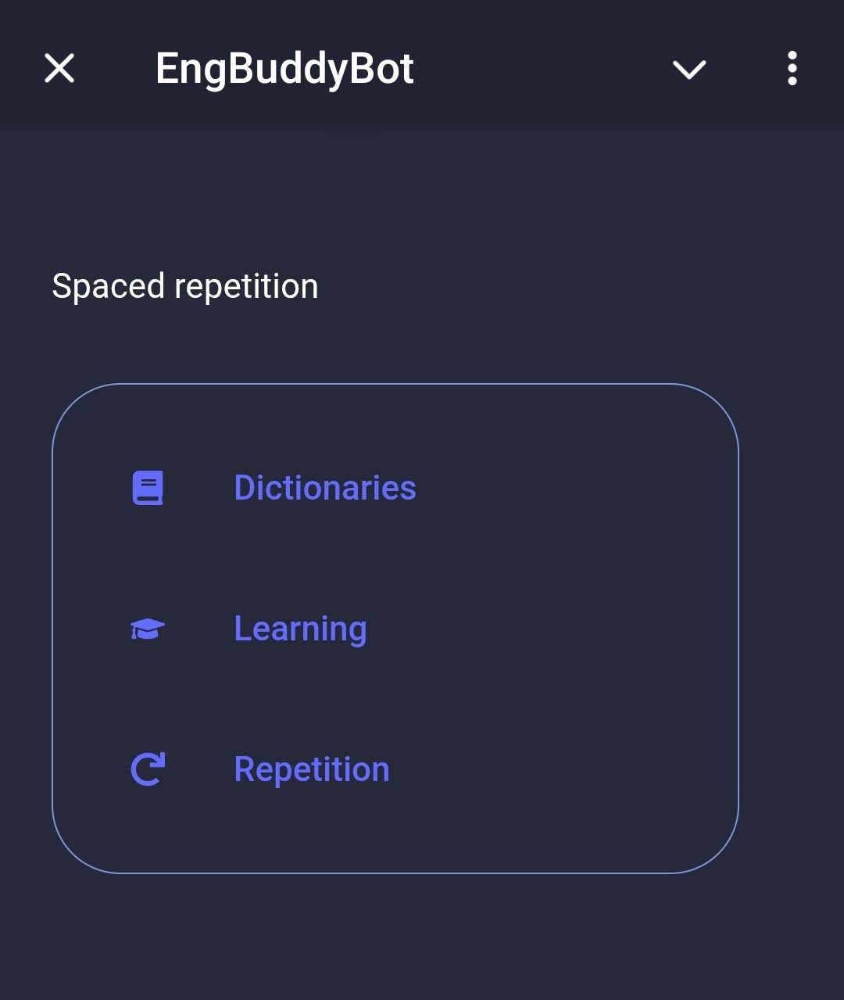

# Telegram бот для английских слов

## Содержание

1. [Описание](#1-Веб-сервер)
2. [Запуск](#2-Запуск)
3. [Переменные среды](#3-Переменные-среды)
4. [Эндпоинты](#4-Эндпоинты)

## 1. Описание

Телеграм бот для изучения английских слов на основе
алгоритма [интервального повторения](https://ru.wikipedia.org/wiki/%D0%98%D0%BD%D1%82%D0%B5%D1%80%D0%B2%D0%B0%D0%BB%D1%8C%D0%BD%D1%8B%D0%B5_%D0%BF%D0%BE%D0%B2%D1%82%D0%BE%D1%80%D0%B5%D0%BD%D0%B8%D1%8F).
С ботом можно общаться как через сообщения, так и через WebApp (при наличии домена и белого ip).
Бот написан с упором на микросервисную архитектуру. Основные сценарии вынесены в makefile.
Celery используется для уведомления неактивных пользователей. Если в течении дня(например)
пользователь не посылал команды - это повод сообщить ему о том, что стоит повторить слова!)

### Так выглядит взаимодействие с ботом через WebApp в телеграм:

    
    

## Backend

### server

- Fastapi
- Celery (Redis, RabbitMQ)

### Database

- SQLModel (синтаксический сахар над SQLAlchemy)
- Alembic

### bot

- aiogram
- aiogram_dialog

## Frontend

- React

## Ci

- Github actions

## 2. Запуск

Создаём виртуальное окружение, находясь в папке с проектом

`python3 -m venv .venv`

подключаемся к локальному интерпретатору

`source .venv/bin/activate`

запускаем проект через

`make run`

Более подробно о `makefile` командах.

|     command name | brief description                                |
|-----------------:|:-------------------------------------------------|
|              run | запустить дев среду                              |
|             lint | линковка через isort, black, flake8              |
|          migrate | применить миграции из папки vesrions             |
| create migration | создать миграции на основе изменений в schema.py |
|               up | запуск compose                                   |
|             down | остановка compose                                |
|             test | выполнить тесты                                  |

и вручную запустить оба сервиса.

## 3. Переменные среды

Для запуска в production понадобятся следующие переменные среды:

|           Переменная среды | Пример значения по умолчанию | Краткое описание                                            |
|---------------------------:|:-----------------------------|-------------------------------------------------------------|
|                POSTGRES_DB | mydatabase                   | имя базы данных                                             |
|              POSTGRES_USER | postgres                     | имя пользователя базы данных                                |
|          POSTGRES_PASSWORD | password                     | пароль базы данных                                          |
|                    DB_HOST | localhost                    | адрес базы данных                                           |
|                    DB_PORT | 5432                         | порт базы данных                                            |
|                      TOKEN | telegram_token               | тelegram токен бота                                         |
|                SERVER_HOST | localhost                    | Ip адрес сервера                                            |
|                SERVER_PORT | 8000                         | порт сервера                                                |
|               DOMAIN_EMAIL | example@example.com          | почта, для создания сертификата                             |
|                 DOMAIN_URL | example.com                  | домен, для создания сертификата                             |
|                 CHUNK_SIZE | 10                           | кол-во элементов в группе для отправки уведомлений          |
|      RABBITMQ_DEFAULT_USER | user                         | имя пользователь для брокера сообщений                      |
|      RABBITMQ_DEFAULT_PASS | password                     | пароль пользователя для брокера сообщений                   |
|     GF_SECURITY_ADMIN_USER | admin                        | Имя пользователя админки Grafana                            |
| GF_SECURITY_ADMIN_PASSWORD | admin                        | Пароль пользователя админки Grafana                         |
|     GF_USERS_ALLOW_SIGN_UP | false                        | Возможность самостоятельной регистрации новых пользователей |

### 4. Эндпоинты

Все Fastapi эндпоинты `http://localhost:8000/docs`
Front `http://localhost:3001`
RabbitMQ Admin `http://localhost:15672`
Grafana `http://localhost:3000`
