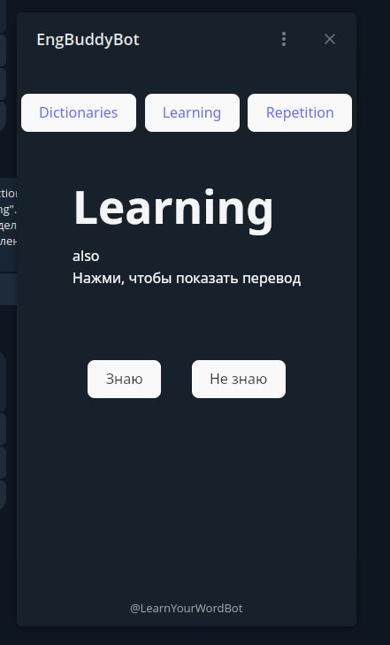

# Telegram бот для английских слов

## Содержание

1. [Описание](#1-Веб-сервер)
2. [Запуск](#2-Запуск)
3. [Переменные среды](#3-Переменные-среды)
4. [Эндпоинты](#4-Эндпоинты)

## 1. Описание

Телеграм бот для изучения английских слов на основе алгоритма [интервального повторения](https://ru.wikipedia.org/wiki/%D0%98%D0%BD%D1%82%D0%B5%D1%80%D0%B2%D0%B0%D0%BB%D1%8C%D0%BD%D1%8B%D0%B5_%D0%BF%D0%BE%D0%B2%D1%82%D0%BE%D1%80%D0%B5%D0%BD%D0%B8%D1%8F). 
С ботом можно общаться как через сообщения, так и через WebApp (при наличии домена и белого ip).
Бот написан с упором на микросервисную архитектуру, т.е. без проблем можно запустить 
только `бд`, `бд и сервер`, `бота, redis и celery`. Основные сценарии вынесены в makefile. 
Celery используется для уведомления неактивных пользователей. Если в течении дня(например) 
пользователь не посылал команды - это повод сообщить ему о том, что стоит повторить слова!)

### Так выглядит взаимодействие с ботом через WebApp в телеграм:

    
    

## Backend
### server
- Fastapi
- Celery

### Database
- SQLModel (синтаксический сахар над SQLAlchemy)  
- Alembic

### bot
- aiogram
- aiogram_dialog

## Frontend
- React 

## 2. Запуск

Создаём виртуальное окружение, находясь в папке с проектом 

`python3 -m venv .venv`

подключаемся к локальному интерпретатору

`source .venv/bin/activate`

запускаем проект через 

`make dev`

Из compose файла запустится только база данных, бот и сервер будут запущены 
локально через tmux. Если нужен дебаг, можно запустить только базу данных

`make db`

и вручную запустить оба сервиса.

## 3. Переменные среды

Для запуска в production понадобятся следующие переменные среды:

| Переменная среды | Значение по умолчанию | Краткое описание                                   |
|-----------------:|:----------------------|----------------------------------------------------|
|          db_name | mydatabase            | имя базы данных                                    |
|          db_user | postgres              | имя пользователя базы данных                       |
|      db_password | password              | пароль базы данных                                 |
|          db_host | localhost             | Адрес базы данных                                  |
|          db_port | 5432                  | Порт базы данных                                   |
|            token | telegram_token        | Telegram токен бота                                |
|      server_host | localhost             | Ip адрес сервера                                   |
|      server_port | 8000                  | Порт сервера                                       |
|     domain_email | example@example.com   | Почта, для создания сертификата                    |
|       domain_url | example.com           | Домен, для создания сертификата                    |
|       chunk_size | 10                    | Кол-во элементов в группе для отправки уведомлений |

### 4. Эндпоинты

Эндпоинты можно посмотреть перейдя на `http://server_host/docs`